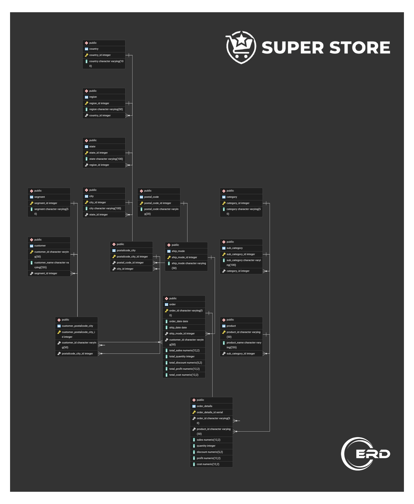

# Superstore Power BI Dashboard with PostgreSQL

This project combines a cleaned Superstore dataset, a PostgreSQL-ready database structure, and a Power BI dashboard to deliver an end-to-end business intelligence workflow.

## Overview

The repository contains:
- Python data preparation and transformation scripts for building normalized tables from the Superstore dataset.
- SQL database schema files for PostgreSQL.
- Power BI dashboard visuals and supporting ERD assets.

This makes it easy to reproduce the analysis pipeline from raw CSV data to a polished dashboard.

## Features

- Data cleaning and transformation using Python and Pandas
- Normalized table generation for customers, products, orders, and locations
- PostgreSQL schema support for relational storage
- Power BI dashboard presentation assets for visual storytelling
- ERD diagrams to understand the database relationships

## Project Structure

- `main/` — Python script and Jupyter notebook for data preparation
- `Assets/DB/` — PostgreSQL database files
- `Assets/ERD/` — Entity Relationship Diagrams
- `Assets/Dashboard Presentation/` — Dashboard screenshots and presentation visuals

## Technology Stack

- Python
- Pandas
- PostgreSQL
- Power BI
- SQL

## How to Use

1. Open the dataset and transformation script in `main/`.
2. Run the Python script to generate the cleaned data outputs.
3. Load the PostgreSQL schema from `Assets/DB/` into your PostgreSQL database.
4. Import the prepared tables into Power BI and connect the dashboard visuals.

## Dashboard Preview

Below are sample visuals from the dashboard presentation assets included in this repository:

## ERD Preview

## Notes

The Power BI dashboard presentation images and ERD diagrams are stored under the `Assets/` folder for documentation and visual reference.

